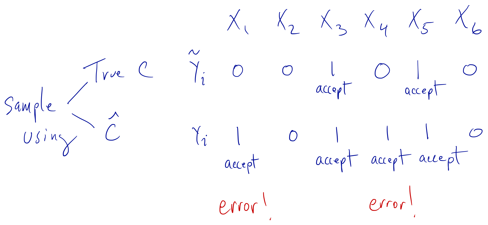

# Independent Monte Carlo

Suppose we want to compute for some function $h: \mathbb{R}^k\rightarrow\mathbb{R}$, 
\[
\mathbb{E}_f[h(X)] = \int h(x)f(x)\,dx.
\]

If we could simulate $x_1,\dots,x_n\stackrel{\text{i.i.d.}}{\sim} f$, then by the law of large numbers, we would have 
\[
\frac{1}{n}\sum_{i=1}^n h(x_i)
\longrightarrow
\mathbb{E}_f[h(X)].
\]

Furthermore, we have that 
\[
\text{Var}\left(\frac{1}{n}\sum_{i=1}^n h(x_i)\right)
=
\frac{1}{n^2}\sum_{i=1}^n \text{Var}(h(X_i))
=
\frac{1}{n}\text{Var}(h(X_1)),
\]
which, we will note for now, does not depend on the dimension of the random variable $X_1$. 

This approach to computing the expectation above is known as Monte Carlo integration which takes advantage of the law of large numbers saying that averages of numbers converge to their expectation. Monte Carlo integration can be quite useful, but it takes the problem of computing the integral directly (or via approximation) and replaces it with a problem of drawing samples from an arbitrary density function $f$. 

Before we go further, we will take a brief diversion into random number generation.

## Random Number Generation

In order to use the simulation-based techniques described in this book, we will need to be able to generate sequences of random numbers. Most of the time in the software we are using, there is a function that will do this for us. For example, in R, if we want to generate uniformly distributed random numbers over a fixed interval, we can use the `runif()` function. 

Nevertheless, there are two issues that are worth considering here:

1. It is useful to know a little about what is going on under the hood of these random number generators. How exactly is the sequence of numbers created?

2. Built-in functions in R are only useful for well-known or well-characterized distributions. However, wil many simulation-based techniques, we will want to generate random numbers from distributions that we have likely never seen before and for which there will not be any built-in function.

### Pseudo-random Numbers

The truth is that R, along with most other analytics packages, does not generate genuine random numbers. R generates *pseudo-random numbers* that appear to be random but are actually generated in a deterministic way. This approach sounds worse, but it's actually better for two reasons. First, generating genuine random  numbers can be slow and often will depend on some outside source of entropy/randomness. Second, genuine random numbers are not reproducible, so if you wanted to re-create some results based on simulations, you would not ever be able to do so.

[Pseudo-random number generators](https://en.wikipedia.org/wiki/Pseudorandom_number_generator) (PRNGs have a long history that we will not cover here. One useful thing to know is that this is tricky area and it is not simple to wander in and start developing your own PRNGs. It is useful to know how the systems work, but after that it's best to leave the specifics to the experts.

The most commonly used class of PRNGs in scientific applications is the *linear congruential generator*. The basic idea behind an LCG is that we have a starting *seed*, and then from there we generate pseudo-random numbers via a recurrence relation. Most LCGs have the form
\[
X_{n+1} = (aX_n + c)~\text{mod}~m
\]
where $a$ is called the *multiplier*, $c$ is the *increment*, and $m$ is the *modulus*. For $n=0$, the value $X_0$ is the seed. Modular arithmetic is needed in order to prevent the sequence from going off to infinity. For most generators, the values $X_0,X_1,\dots$ are integers. However, we could for example generate Uniform(0, 1) variates by taking $U_n = X_n / m$.

Given the recurrence relation above and the modular arithmetic, the maximum number of distinct values that can be generated by an LCG is $m$, so we would need $m$ to be very large. The hope is that if the PRNG is well-designed, the sequence should hit every number from $0$ to $m-1$ before repeating. If a number is repeated before all numbers are seen, then the generator has a period in it that is shorter than the maximal period that is possible. Setting the values of $a$, $c$, and $m$ is a tricky business and can require some experimentation. In summary, don't do this at home. As an (historical) example, the random number generator proposed by the book [*Numerical Recipes*](https://en.wikipedia.org/wiki/Numerical_Recipes) specified that $a = 1664525$, $c = 1013904223$, and $m = 2^{32}$. 

Perhaps the biggest problem with using the historical LCGs for generating random numbers is that their periods are too short, even if they manage to hit the maximal period. Given the scale of simulations being conducted today, even a period of $2^{32}$ would likely be too short to appear sufficiently random. Most analytical software systems have since moved on to other more sophisticated generators. For example, the default in R is the [Mersenne-Twister](https://en.wikipedia.org/wiki/Mersenne_Twister), which has a long period of $2^{19937} − 1$. 

Further notes:

* The randomness of a pseudo-random sequence can be checked via statistical tests of uniformity, such as the Kolmogorov-Smirnoff test, Chi-square test, or the [Marsaglia "die hard" tests](https://en.wikipedia.org/wiki/Diehard_tests). 

* Many PRNGs generate sequences that look random in one dimension but do not look random when embedded into higher dimensions. It is possible for PRNGs to generate numbers that lie on a higher-dimensional hyperplane that still look random in one dimension.

## Non-Uniform Random Numbers

Uniform random numbers are useful, but usually we want to generate random numbers from some non-uniform distribution. There are a few ways to do this depending on the distribution. 


### Inverse CDF Transformation

The most generic method (but not necessarily the simplest) uses the inverse of the cumulative distribution function of the distribution.

Suppose we wnat to draw samples from a distribution with density $f$ and cumulative distribution function $F(x) = \int_{-\infty}^x f(t)\,dt$. Then we can do the following:

1. Draw $U\sim \text{Unif}(0, 1)$ using any suitable PRNG.

2. Let $X = F^{-1}(U)$. Then $X$ is distributed according to $f$.

Of course this method requires the inversion of the CDF, which is usually not possible. However, it works well for the Exponential($\lambda$) distribution. Here, we have that
\[
f(x) = \frac{1}{\lambda}e^{-x/lambda}
\]
and
\[
F(x) = 1-e^{-x/\lambda}.
\]
Therefore, the inverse of the CDF is
\[
F^{-1}(u) = -\lambda\log(1-u).
\]

First we can draw our uniform random variables.

```{r}
set.seed(2017-12-4)
u <- runif(100)
hist(u)
rug(u)
```

Then we can apply the inverse CDF.

```{r}
lambda <- 2  ## Exponential with mean 2
x <- -lambda * log(1 - u)
hist(x)
rug(x)
```

The problem with this method is that inverting the CDF is usually a difficult process and so other methods will be needed to generate other random variables.


### Other Transformations

The inverse of the CDF is not the only function that we can use to transform uniform random variables into random variables with other distributions. Here are some common transformations.

To generate **Normal** random variables, we can

1. Generate $U_1, U_2\sim\text{Unif}(0, 1)$ using a standard PRNG.

2. Let
\begin{eqnarray*}
Z_1 & = & \sqrt{-2\log U_1}\cos(2\pi\, U_2)\\
Z_2 & = & \sqrt{-2\log U_1}\sin(2\pi\, U_2)
\end{eqnarray*}
Then $Z_1$ and $Z_2$ are distributed independent $N(0, 1)$. 

What about multivariate Normal random variables with arbitrary covariance structure? This can be done by applying an affine transformation to independent Normals. 

If we want to generate $X\sim\mathcal{N}(\mu, \Sigma)$, we can

1. Generate $Z\sim\mathcal{N}(0, I)$ where $I$ is the identity matrix;

2. Let $\Sigma = LL^\prime$ be the Cholesky decomposition of $\Sigma$. 

3. Let $X = \mu + Lz$. Then $X\sim\mathcal{N}(\mu, \Sigma)$.

In reality, you will not need to apply *any* of the transformations described above because almost any worthwhile analytical software system will have these generators built in, if not carved in stone. However, once in a while, it's still nice to know how things work.

## Rejection Sampling

What do we do if we want to generate samples of a random variable with density $f$ and there isn't a built in function for doing this? If the random variable is of a reasonably low dimension (less than $10$?), then *rejection sampling* is a plausible general approach. 

The idea of rejection sampling is that although we cannot easily sample from $f$, there exists another density $g$, like a Normal distribution or perhaps a $t$-distribution, from which it is easy for us to sample (because there's a built in function or someone else wrote a nice function). Then we can sample from $g$ directly and then "reject" the samples in a strategic way to make the resulting "non-rejected" samples look like they came from $f$. The density $g$ will be referred to as the "candidate density" and $f$ will be the "target density". 

In order to use the rejections sampling algorithm, we must first ensure that the support of $f$ is a subset of the support of $g$. If $\mathcal{X}_f$ is the support of $f$ and $\mathcal{X}_g$ is the support of $g$, then we must have $\mathcal{X}_f\subset\mathcal{X}_g$. This makes sense: if there's a region of the support of $f$ that $g$ can never touch, then that area will never get sampled. In addition, we must assume that
\[
c = \sup_{x\in\mathcal{X}_f} \frac{f(x)}{g(x)} < \infty
\]
and that we can calculate $c$. The easiest way to satisfy this assumption is to make sure that $g$ has heavier tails than $f$. We cannot have that $g$ decreases at a faster rate than $f$ in the tails or else rejection sampling will not work. 

### The Algorithm

The rejection sampling algorithm for drawing a sample from the target density $f$ is then

1. Simulate $U\sim\text{Unif}(0, 1)$.

2. Simulate a candidate $X\sim g$ from the candidate density

3. If
$$
U\leq\frac{f(X)}{c\,g(X)}
$$
then "accept" the candidate $X$. Otherwise, "reject" $X$ and go back to the beginning.

The algorithm can be repeated until the desired number of samples from the target density $f$ has been accepted.

As a simple example, suppose we wanted to generate samples from a $\mathcal{N}(0, 1)$ density. We could use the $t_2$ distribution as our candidate density as it has heavier tails than the Normal. Plotting those two densities, along with a sample from the $t_2$ density gives us the picture below. 

```{r,warning=FALSE}
set.seed(2017-12-4)
curve(dnorm(x), -6, 6, xlab = "x", ylab = "Density", n = 200)
curve(dt(x, 2), -6, 6, add = TRUE, col = 4, n = 200)
legend("topright", c("Normal density", "t density"), 
       col = c(1, 4), bty = "n", lty = 1)
x <- rt(200, 2)
rug(x, col = 4)
```

Given what we know about the standard Normal density, most of the samples should be between $-3$ and $+3$, except perhaps in very large samples (this is a sample of size `r length(x)`). From the picture, there are samples in the range of $4$--$6$. In order to transform the $t_2$ samples into $\mathcal{N}(0, 1)$ samples, we will need to reject many of the samples out in the tail. On the other hand, there are two *few* samples in the range of $[-2, 2]$ and so we will have to disproportionaly accept samples in that range until it represents the proper $\mathcal{N}(0, 1)$ density.

Before we move on, it's worth noting that the rejection sampling method requires that we can *evaluate* the target density $f$. That is how we compute the rejection/acceptance ratio in Step 2. In most cases, this will not be a problem.


### Properties of Rejection Sampling

One property of the rejection sampling algorithm is that the number of draws we need to take from the candidate density $g$ before we accept a candidate is a geometric random variable with success probability $1 / c$. We can think of the decision to accept or reject a candidate as a sequence of iid coin flips that has a specific probability of coming up "heads" (i.e. being accepted). That probability is $1/c$ and we can calculate that as follows.

\begin{eqnarray*}
\mathbb{P}(X~\text{accepted})
& = & 
\mathbb{P}\left(U\leq\frac{f(X)}{c\,g(X)}\right)\\
& = &
\int
\mathbb{P}\left(\left.U\leq\frac{f(x)}{c\,g(x)}\right| X = x\right)g(x)\,dx\\
& = &
\int \frac{f(x)}{c\,g(x)} g(x)\,dx\\
& = &
\frac{1}{c}
\end{eqnarray*}

This property of rejection sampling has implications for how we choose the candidate density $g$. In theory, any density can be chosen as the candidate as long as its support includes the support of $f$. However, in practice we will want to choose $g$ so that it matches $f$ as closely as possible. As a rule of thumb, candidates $g$ that match $f$ closely will have smaller values of $c$ and thus will accept candidates with higher probability. We want to avoid large values of $c$ because large values of $c$ lead to an algorithm that rejects a lot of candidates and has lower efficiency. 

In the example above with the Normal distribution and the $t_2$ distribution, the ratio $f(x)/g(x)$ was maximized at $x=1$ (or $x=-1$) and so the value of $c$ for that setup was `r round(dnorm(1)/dt(1,2),3)`, which implies an acceptance probability of about `r round(dt(1,2)/dnorm(1),2)`. Suppose however, that we wanted to simulate from a Uniform$(0,1)$ density and we used an Exponential$(1)$ as our candidate density. The plot of the two densities looks as follows.

```{r}
curve(dexp(x, 1), 0, 1, col = 4, ylab = "Density")
segments(0, 1, 1, 1)
legend("bottomleft", c("f(x) Uniform", "g(x) Exponential"), lty = 1, col = c(1, 4), bty = "n")
```

Here, the ratio of $f(x)/g(x)$ is maximized at $x=1$ and so the value of $c$ is `r round(1/dexp(1, 1), 3)` which implies an acceptance probablity of about `r round(dexp(1,1),2)`. While running the rejection sampling algorithm in this way to produce Uniform random variables will still work, it will be very inefficient.


We can now show that the distribution of the accepted values from the rejection sampling algorithm above follows the target density $f$. We can do this by calculating the *distribution function* of the accepted values and show that this is equal to $F(t) = \int_{-\infty}^t f(x)\, dx$. 

\begin{eqnarray*}
\mathbb{P}(X\leq t\mid X~\text{accepted})
& = &
\frac{\mathbb{P}(X\leq t, X~\text{accepted})}{\mathbb{P}(X~\text{accepted})}\\
& = & 
\frac{\mathbb{P}(X\leq t, X~\text{accepted})}{1/c}\\
& = &
c\,
\mathbb{E}_g
\mathbb{E}\left[
\left.\mathbf{1}\{x\leq t\}\mathbf{1}\left\{U\leq\frac{f(x)}{c\,g(x)}\right\}\right| X=x
\right]\\
& = &
c\,
\mathbb{E}_g\left[\mathbf{1}\{X\leq t\}
\mathbb{E}\left[
\left.\mathbf{1}\left\{U\leq\frac{f(x)}{c\,g(x)}\right\}\right| X=x
\right]\right]\\
& = &
c\,
\mathbb{E}_g\left[
\mathbf{1}\{X\leq t\}\frac{f(X)}{c\,g(X)}
\right]\\
& = &
\int_{-\infty}^{\infty}
\mathbf{1}\{x\leq t\}
\frac{f(x)}{g(x)}g(x)\,dx\\
& = &
\int_{-\infty}^t f(x)\,dx\\
& = &
F(t)
\end{eqnarray*}
This shows that the distribution function of the candidate values, given that they are accepted, is equal to the distribution function corresponding to the target density.


A few further notes:

1. We only need to know $f$ and $g$ up to a constant of proportionality. In many applications we will not know the normalizing constant for these densities, but we do not need them. That is, if $f(x) = k_1 f^\star(x)$ and $g(x) = k_2 g^\star(x)$, we can proceed with the algorithm using $f^\star$ and $g^\star$ even if we do not know the values of $k_1$ and $k_2$. 

2. Any number $c^\prime \geq c$ will work in the rejection sampling algorithm, but the algorithm will be less efficient.

3. Throughout the algorithm, operations can (and should!) be done on a log scale.

4. The higher the dimension of $f$ and $g$, the less efficient the rejection sampling algorithm will be.

5. Whether $c=\infty$ or not depends on the tail behavior of the the densities $f$ and $g$. If $g(x)\downarrow 0$ faster than $f(x)\downarrow 0$ as $x\rightarrow\infty$, then $f(x)/g(x)\uparrow\infty$.

### Empirical Supremum Rejection Sampling

What if we cannot calculate $c = \sup_{x\in\mathcal{X}_f} \frac{f(x)}{g(x)}$ or are simply too lazy to do so? Fear not, because it turns out we almost never have to do so. A slight modification of the standard rejection sampling algorithm will allow us to *estimate* $c$ while also sampling from the target density $f$. The tradeoff (there is always a tradeoff!) is that we must make a more stringent assumption about $c$, mainly that it is achievable. That is, there exists some value $x_c\in\mathcal{X}_f$ such that $\frac{f(x_c)}{g(x_c)}$ is *equal* to $\sup_{x\in\mathcal{X}_f} \frac{f(x)}{g(x)}$. 

The modified algorithm is the *empirical supremum rejection sampling* algorithm of [Caffo, Booth, and Davison](https://academic.oup.com/biomet/article-abstract/89/4/745/242234). The algorithm goes as follows. First we must choose some starting value of $c$, call it $\hat{c}$, such that $\hat{c}> 1$. Then,

1. Draw $U\sim\text{Unif}(0, 1)$.

2. Draw $X\sim g$, the candidate density.

3. Accept $X$ if $U\leq\frac{f(X)}{\hat{c}\,g(X)}$, otherwise reject $X$.

4. Let $\hat{c}^\star = \max\left\{\hat{c}, \frac{f(X)}{g(X)}\right\}$.

5. Update $\hat{c} = \hat{c}^\star$.

6. Goto Step 1.

From the algorithm we can see that at each iteration, we get more information about the ratio $f(X)/g(X)$ and can update our estimate of $c$ accordingly.

One way to think of this algorithm is to conceptualize a separate sequence $\tilde{Y}_i$, which is $0$ or $1$ depending on whether $X_i$ should be rejected ($0$) or accepted ($1$). This sequence $\tilde{Y}_i$ is the accept/reject determination sequence. Under the standard rejection sampling algorithm, the sequence $\tilde{Y}_i$ is generated using the true value of $c$. Under the emprical supremum rejection sampling (ESUP) scheme, we generate a slightly different sequence $Y_i$ using our continuously updated value of $\hat{c}$.

If we drew values $X_1, X_2, X_3, X_4, X_5, X_6,\dots$ from the candidate density $g$, then we could visualize the acceptance/rejection process as it might occur using the true value of $c$ and our estimate $\hat{c}$.



Following the diagram above, we can see that using the estimate $\hat{c}$, there are two instances where we accept a value when we should have rejected it ($X_1$ and $X_4$). In every other instance in the sequence, the value of $Y_i$ was equal to $\tilde{Y}_i$. The theory behind the ESUP algorithm is that eventually, the sequence $Y_i$ becomes identical to the sequence $\tilde{Y}_i$ and therefore we will accept/reject candidates in the same manner as we would have if we had used the true $c$.

If $f$ and $g$ are discrete distributions, then the proof of the ESUP algorithm is fairly straightforward. Specifically, Caffo, Booth, and Davison showed that $\mathbb{P}(Y_i \ne \tilde{Y}_i~\text{infinitely often}) = 0$. Recall that by assumption, there exists some $x_c\in\mathcal{X}_f$ such that $c = \frac{f(x_c)}{g(x_c)}$. Therefore, as we independently sample candidates from $g$, at *some point*, we will sample the value $x_c$, in which case we will achieve the value $c$. Once that happens, we are then using the standard rejection sampling algorithm and our estimate $\hat{c}$ never changes.

Let $\gamma = \min_i\{ x_i = x_c\}$, where $x_i\sim g$. So $\gamma$ is the first time that we see the value $x_c$ as we are sampling candidates $x_i$ from $g$. The probability that we sample $x_c$ is $g(x_c)$ (recall that $g$ is assumed to be discrete here) and so $\gamma$ has a Geometric distribution with success probability $g(x_c)$. Once we observe $x_c$, the ESUP algorithm and the standard rejection sampling algorithms converge and are identical.

From here, we can use the coupling inequality, which tells us that
$$
\mathbb{P}(Y_i\ne\tilde{Y}_i)
\leq
\mathbb{P}(\gamma\geq i).
$$
Given that $\gamma\sim\text{Geometric}(g(x_c))$, we know that
$$
\mathbb{P}(\gamma\geq i) = (1-g(x_c))^{i-1}.
$$
This then implies that
$$
\sum_{i=1}^\infty
\mathbb{P}(Y_i\ne\tilde{Y}_i) < \infty
$$
which, by the [Borel-Cantelli lemma](https://en.wikipedia.org/wiki/Borel–Cantelli_lemma), implies that $\mathbb{P}(Y_i \ne \tilde{Y}_i~\text{infinitely often}) = 0$. Therefore, eventually the sequences $Y_i$ and $\tilde{Y}_i$ must converge and at that point the ESUP algorithm will be identical to the rejection sampling algorithm.

In practice, we will know know exactly when the ESUP algorithm has converged to the standard rejection sampling algorithm. However, Caffo, and Davison report that the convergence is generally fast. Therefore, a reasonable approach might be to discard the first several accepted values (e.g. a "burn in") and then use the remaining values. 

We can see how quickly ESUP converges in a simple example where the target density is the standard Normal and the candidate density is the $t_2$ distribution. Here we simulate 1,000 draws and start with a value $\hat{c}=1.0001$. Note that in the code below, all of the computations are done on the log scale for the sake of numerical stability.

```{r}
set.seed(2017-12-04)
N <- 500
y_tilde <- numeric(N)  ## Binary accept/reject for "true" algorithm
y <- numeric(N)        ## Binary accept/reject for ESUP
log_c_true <- dnorm(1, log = TRUE) - dt(1, 2, log = TRUE)
log_chat <- numeric(N + 1)
log_chat[1] <- log(1.0001)  ## Starting c value
for(i in seq_len(N)) {
        u <- runif(1)
        x <- rt(1, 2)
        r_true <- dnorm(x, log = TRUE) - dt(x, 2, log = TRUE) - log_c_true
        rhat <- dnorm(x, log = TRUE) - dt(x, 2, log = TRUE) - log_chat[i]
        y_tilde[i] <- log(u) <= r_true
        y[i] <- log(u) <= rhat
        log_chat[i+1] <- max(log_chat[i], 
                             dnorm(x, log = TRUE) - dt(x, 2, log = TRUE))
}
```

Now we can plot $\log_{10}(|\hat{c}-c|)$ for each iteration to see how the magnitude of the error changes with each iteration.

```{r}
c_true <- exp(log_c_true)
chat <- exp(log_chat)
plot(log10(abs(chat - c_true)), type = "l",
     xlab = "Iteration", ylab = expression(paste(log[10], "(Absolute Error)")))

```

We can see that by iteration 40 or so, $\hat{c}$ and $c$ differ only in the 5th decimal place and beyond. By the 380th iteration, they differ only beyond the 6th decimal place.


## Importance Sampling

With rejection sampling, we ultimately obtain a sample from the target density $f$. With that sample, we can create any number of summaries, statistics, or visualizations. However, what if we are interested in the more narrow problem of computing a mean, such as $\mathbb{E}_f[h(X)]$ for some function $h:\mathbb{R}^k\rightarrow\mathbb{R}$? Clearly, this is a problem that can be solved with rejection sampling: First obtain a sample $x_1,\dots,x_n\sim f$ and then compute
$$
\hat{\mu}_n = \frac{1}{n}\sum_{i=1}^n h(x_i).
$$
with the obtained sample. As $n\rightarrow\infty$ we know by the Law of Large Numbers that $\hat{\mu}_n\rightarrow\mathbb{E}_f[h(X)]$. Further, the Central Limit Theorem gives us $\sqrt{n}(\hat{\mu}_n-\mathbb{E}_f[h(X)])\longrightarrow\mathcal{N}(0,\sigma^2)$. So far so good.

However, with rejection sampling, in order to obtain a sample of size $n$, we must generate, on average, $c\times n$ candidates from $g$, the candidate density, and then reject about $(c-1)\times n$ of them. If $c\approx 1$ then this will not be too inefficient. But in general, if $c$ is much larger than $1$ then we will be generating a lot of candidates from $g$ and ultimately throwing most of them away.

It's worth noting that in most cases, the candidates generated from $g$ fall within the domain of $f$, so that they are in fact values that could plausibly come from $f$. They are simply over- or under-represented in the frequency with which they appear. For example, if $g$ has heavier tails than $f$, then there will be too many extreme values generated from $g$. Rejection sampling simply thins out those extreme values to obtain the right proportion. But what if we could take those rejected values and, instead of discarding them, simply downweight or upweight them in a specific way?

Note that we can rewrite the target estimation as follows,
$$
\mathbb{E}_f[h(X)]
=
\mathbb{E}_g\left[\frac{f(X)}{g(X)}h(X)\right].
$$

Hence, if $x_1,\dots,x_n\sim g$, drawn from the candidate density, we can say
$$
\tilde{\mu}_n
=
\frac{1}{n}\sum_{i=1}^n\frac{f(x_i)}{g(x_i)}h(x_i)
=
\frac{1}{n}\sum_{i=1}^n w_i h(x_i)
\approx
\mathbb{E}_f[h(X)]
$$

In the equation above, the values $w_i=f(x_i)/g(x_i)$ are referred to as the *importance weights* because they take each of the candidates $x_i$ generated from $g$ and reweight them when taking the average. Note that if $f = g$, so that we are simply sampling from the target density, then this estimator is just the sample mean of the $h(x_i)$s. The estimator $\tilde{\mu}_n$ is known as the *importance sampling* estimator.

When comparing rejection sampling with importance sampling, we can see that

* Rejection sampling samples directly from $f$ and then uses the samples to compute a simple mean

* Importance sampling samples from $g$ and then reweights those samples by $f(x)/g(x)$

For estimating expectations, one might reasonably believe that the importance sampling approach is more efficient than the rejection sampling approach because it does not discard any data. 

In fact, we can see this by writing the rejection sampling estimator of the expectation in a different way. Let $c=\sup_{x\in\mathcal{X}_f}f(x)/g(x)$. Given a sample $x_1,\dots,x_n\sim g$ and $u_1,\dots,u_n\sim\text{Unif}(0,1)$, then
$$
\hat{\mu}_n
=
\frac{
\sum_i\mathbf{1}\left\{u_i\leq\frac{f(x_i)}{c\,g(x_i)}\right\}h(x_i)
}{
\sum_i\mathbf{1}\left\{u_i\leq\frac{f(x_i)}{c\,g(x_i)}\right\}
}
$$

What importance sampling does, effectively, is replace the indicator functions in the above expression with their expectation. So instead of having a hard threshold, where observation $x_i$ is either included (accepted) or not (rejected), importance sampling smooths out the acceptance/rejection process so that every observation plays some role.

If we take the expectation of the indicator functions above, we get (note that the $c$s cancel)
$$
\tilde{\mu}_n = 
\frac{
\sum_i \frac{f(x_i)}{g(x_i)}h(x_i)
}{
\sum_i \frac{f(x_i)}{g(x_i)}
}
=
\frac{
\frac{1}{n}\sum_i \frac{f(x_i)}{g(x_i)}h(x_i)
}{
\frac{1}{n}\sum_i \frac{f(x_i)}{g(x_i)}
}
$$
which is roughly equivalent to the importance sampling estimate if we take into account that
$$
\frac{1}{n}\sum_{i=1}^n\frac{f(x_i)}{g(x_i)}\approx 1
$$
because
$$
\mathbb{E}_g\left[\frac{f(X)}{g(X)}\right]
=
\int \frac{f(x)}{g(x)}g(x)\,dx
=
1
$$
The point of all this is to show that the importance sampling estimator of the mean can be seen as a "smoothed out" version of the rejection sampling estimator. The advantage of the importance sampling estimator is that it does not discard any data and thus is more efficient.


Note that we do not need to know the normalizing constants for the target density or the candidate density. If $f^\star$ and $g^\star$ are the unnormalized target and candidate densities, respectively, then we can use the modified importance sampling estimator,
$$
\mu^\star_n
=
\frac{
\sum_i\frac{f^\star(x_i)}{g^\star(x_i)}h(x_i)
}{
\sum_i\frac{f^\star(x_i)}{g^\star(x_i)}
}.
$$
We can then use [Slutsky's Theorem](https://en.wikipedia.org/wiki/Slutsky%27s_theorem) to say that $\mu^\star_n\rightarrow\mathbb{E}_f[h(X)]$.


### Example: Bayesian Sensitivity Analysis

An interesting application of importance sampling is the examination of the sensitivity of posterior inferences with respect to prior specification. Suppose we observe data $y$ with density $f(y\mid\theta)$ and we specify a prior for $\theta$ as $\pi(\theta\mid\psi_0)$, where $\psi_0$ is a hyperparameter. The posterior for $\theta$ is thus
$$
p(\theta\mid y, \psi_0)
\propto
f(y\mid\theta)\pi(\theta\mid\psi_0)
$$
and we would like to compute the posterior mean of $\theta$. If we can draw $\theta_1,\dots,\theta_n$, a sample of size $n$ from $p(\theta\mid y,\psi_0)$,  then we can estimate the posterior mean with $\frac{1}{n}\sum_i\theta_i$. However, this posterior mean is estimated using a specific hyperparameter $\psi_0$. What if we would like to see what the posterior mean would be for a different value of $\psi$? Do we need to draw a new sample of size $n$? Thankfully, the answer is no. We can simply take our existing sample $\theta_1,\dots,\theta_n$ and reweight it to get our new posterior mean under a different value of $\psi$. 

Given a sample $\theta_1,\dots,\theta_n$ drawn from $p(\theta\mid y,\psi_0)$, we would like to know $\mathbb{E}[\theta\mid y, \psi]$ for some $\psi\ne\psi_0$. The idea is to treat our original $p(\theta\mid y,\psi_0)$ as a "candidate density" from which we have already drawn a large sample $\theta_1,\dots,\theta_n$. Then we want know the posterior mean of $\theta$ under a "target density" $p(\theta\mid y,\psi)$. We can then write our importance sampling estimator as
\begin{eqnarray*}
\frac{
\sum_i\theta_i\frac{p(\theta_i\mid y, \psi)}{p(\theta_i\mid y,\psi_0)}
}{
\sum_i\frac{p(\theta_i\mid y, \psi)}{p(\theta_i\mid y,\psi_0)}
}
& = &
\frac{
\sum_i\theta_i\frac{f(y\mid\theta_i)\pi(\theta_i\mid\psi)}{f(y\mid\theta_i)\pi(\theta_i\mid\psi_0)}
}{
\sum_i\frac{f(y\mid\theta_i)\pi(\theta_i\mid\psi)}{f(y\mid\theta_i)\pi(\theta_i\mid\psi_0)}
}\\
& = &
\frac{
\sum_i\theta_i\frac{\pi(\theta_i\mid\psi)}{\pi(\theta_i\mid\psi_0)}
}{
\sum_i\frac{\pi(\theta_i\mid\psi)}{\pi(\theta_i\mid\psi_0)}
}\\
& \approx &
\mathbb{E}[\theta\mid y,\psi]
\end{eqnarray*}

In this case, the importance sampling weights are simply the ratio of the prior under $\psi$ to the prior under $\psi_0$.


### Example: Calculating Marginal Likelihoods

### Properties of the Importance Sampling Estimator

So far we've talked about how to estimate an expectation with respect to an arbitrary target density $f$ using importance sampling. However, we haven't discussed yet what is the variance of that estimator. An analysis of the variance of the importance sampling estimator is assisted by the [Delta method](https://en.wikipedia.org/wiki/Delta_method) and by viewing the importance sampling estimator as a ratio estimator.

Recall that the Delta method states that if $Y_n$ is a $k$-dimensional random variable with mean $\mu$, $g:\mathbb{R}^k\rightarrow\mathbb{R}$ and is differentiable, and further we have
$$
\sqrt{n}(Y_n-\mu)\stackrel{D}{\longrightarrow}\mathcal{N}(0,\Sigma)
$$
as $n\rightarrow\infty$, then 
$$
\sqrt{n}(g(Y_n)-g(\mu))
\stackrel{D}{\longrightarrow}
\mathcal{N}(0, g^\prime(\mu)^\prime\Sigma g^\prime(\mu))
$$
as $n\rightarrow\infty$.

For the importance sampling estimator, we have $f$ is the target density, $g$ is the candidate density, and $x_1,\dots,x_n$ are samples from $g$. The estimator of $\mathbb{E}_f[h(X)]$ is written as
$$
\frac{\frac{1}{n}\sum_i h(x_i) w(x_i)}{\frac{1}{n}\sum_i w(x_i)}
$$
where
$$
w(x_i) = \frac{f(x_i)}{g(x_i)}
$$
are the importance sampling weights.

If we let $g((a, b)) = a/b$, then $g^\prime((a,b)) = (1/b, -a/b^2)$. If we define the vector $Y_n =  \left(\frac{1}{n}\sum h(x_i) w_i,\,\frac{1}{n}\sum w_i\right)$
then the importance sampling estimator is simply $g(Y_n)$. Furthremore, we have
$$
\mathbb{E}_g[Y_n]
=
\mathbb{E}_g\left[\left(\frac{1}{n}\sum h(x_i) w(x_i),\,\frac{1}{n}\sum w(x_i)\right)\right] 
= 
(\mathbb{E}_f[h(X)], 1)
=
\mu
$$
and 
$$
\Sigma
=
n\,\text{Var}(Y_n)
=
\left(
\begin{array}{cc}
\text{Var}(h(X)w(X)) & \text{Cov}(h(X)w(X), w(X))\\
\text{Cov}(h(X)w(X), w(X)) & \text{Var}(w(X))
\end{array}
\right)
$$
Note that the above quantity can be estimated consistently using the sample versions of each quantity in the matrix. 

Therefore, the variance of the importance sampling estimator of $\mathbb{E}_f[h(X)]$ is $g^\prime(Y_n)^\prime\Sigma g^\prime(Y_n)$ which we can expand to
$$
n\left(
\frac{\sum h(x_i)w(x_i)}{\sum w(x_i)}
\right)^2
\left(
\frac{\sum h(x_i)^2w(x_i)^2}{\left(\sum h(x_i)w(x_i)\right)^2}
-
2\frac{\sum h(x_i)w(x_i)^2}{\left(\sum h(x_i)w(x_i)\right)\left(\sum w(x_i)\right)}
+
\frac{\sum w(x_i)^2}{\left(\sum w(x_i)\right)^2}
\right)
$$
Given this, for the importance sampling estimator, we need the following to be true,
$$
\mathbb{E}_g\left[h(X)^2w(X)^2\right] 
=
\mathbb{E}_g\left[h(X)\frac{f(X)}{g(X)}\right]
< \infty,
$$
$$
\mathbb{E}_g[w(X)^2] 
= 
\mathbb{E}_g\left[\left(\frac{f(X)}{g(X)}\right)^2\right]
< \infty,
$$
and
$$
\mathbb{E}_g\left[h(X)w(X)^2\right]
=
\mathbb{E}_g\left[h(X)\left(\frac{f(X)}{g(X)}\right)^2\right]
< \infty.
$$

All of the above conditions are true if the conditions for rejection sampling are satisfied, that is, if $\sup_{x\in\mathcal{X}_f}\frac{f(x)}{g(x)}<\infty$.
